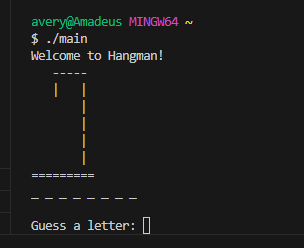
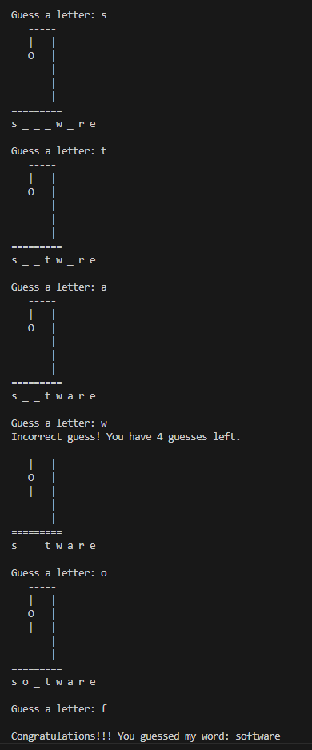
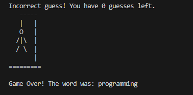

# c-HTP_18.12 

Write a program that plays the game of Hangman. The program should pick a word (which is either coded directly into the program or read from a text file) and display the following:

Guess the word: XXXXX
Each X represents a letter.

The user tries to guess the letters in the word.

The appropriate response "yes" or "no" should be displayed after each guess.

After each incorrect guess, display the diagram with another body part filled.

After seven incorrect guesses, the user should be hanged.

If the user guesses the word correctly, the program should display:

bash
Copy code
Congratulations!!! You guessed my word. Play again? yes/no

# commands
compile
g++ main.cpp -o main -static

run
./main